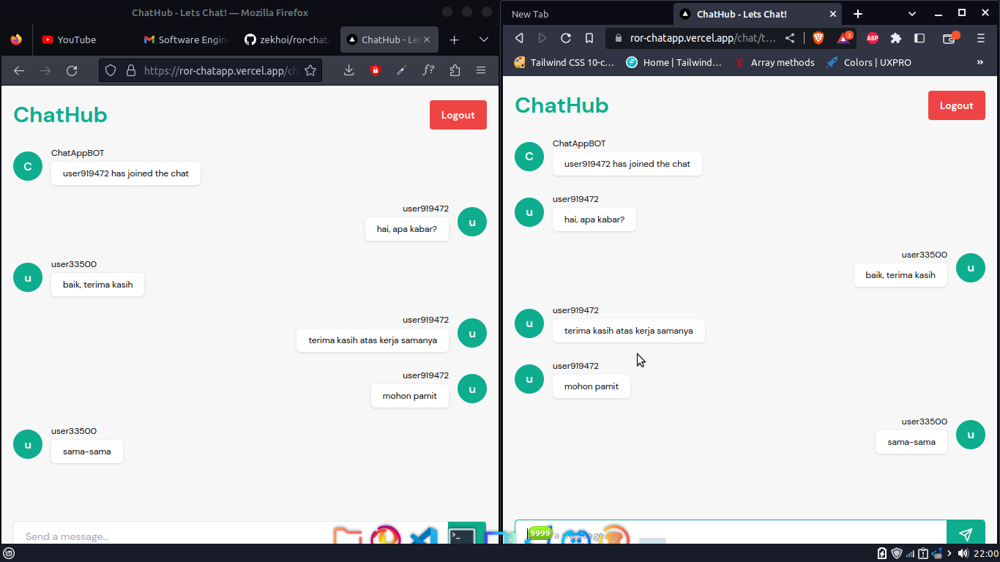

# ChatHub

Aplikasi ini dapat digunakan untuk berkomunikasi dengan cara memasukan username dan room (channel) yang akan digunakan. Setelah itu, user dapat mengirim pesan ke room yang telah dibuat.

Tidak ada data yang disimpan di database karena menggunakan Redis dan user tidak perlu login tetapi username disimpan pada local storage sehingga jika ingin menggunakan user lain harus menggunakan browser lain.

Redis menyimpan pada memori sehingga data akan hilang jika server dimatikan.

# Live Demo

- [Frontend](https://ror-chatapp.vercel.app/) deployed to Vercel
- [Backend](https://ror-chatapp.fly.dev/) deployed to Fly.io
- [Redis](https://ror-chatapp.fly.dev/redis) deployed to upstash via Fly.io

# Tech Stack

- React.js (Next.js)
- Tailwindcss
- Ruby on Rails
- Redis
- PostgreSQL (Not used, only created for exploring)
